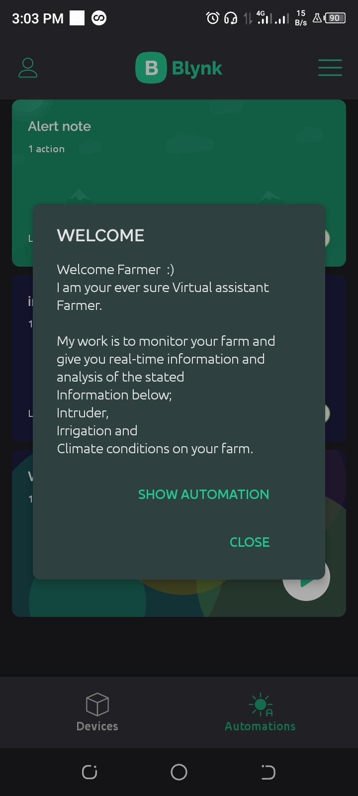
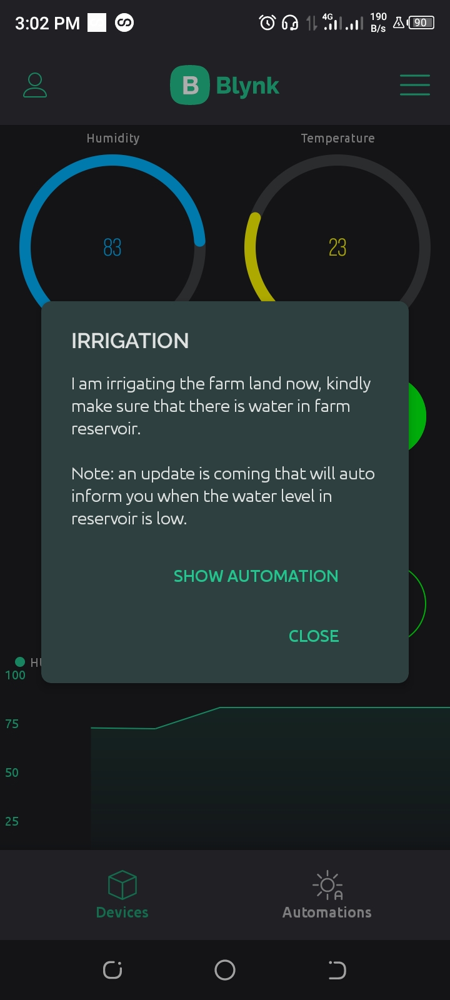
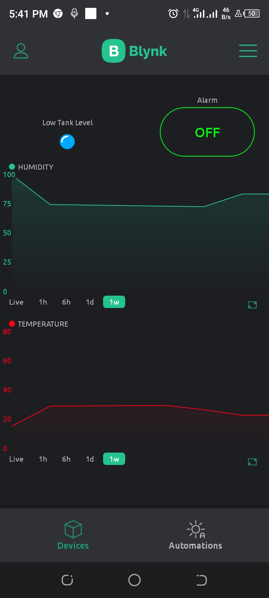
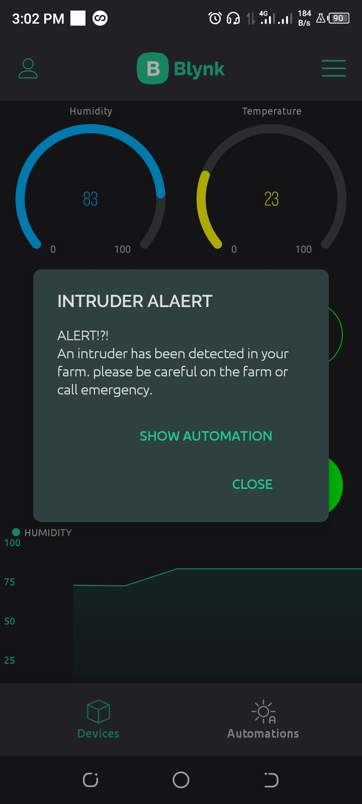

# INTELIGENT FARMER ASSISTANT

Author: Rufus  
Date: 16/10/2022  
Revision: 0.0.1v  
License: Public Domain 

## FUNCTION

This is a powerful system that uses Internet of Things and automation to monitor the following activities on a farm land and give real time information;  
1. Soil moisture,
2. Humidity,
3. Intruder presence,
4. Temperature.

        
        

## How It Works In a Nutshell
  

1. Soil Moisture Monitoring: The soil moisture sensor measure the soil moisture and send the readings to cloud and Once the soil moisture sensor senses that the soil moisture is low, then the farmer get an alert on his/her mobile phone and pump is started automatically to increase soil moisture to a suitable reading.
    

        
        

  

   

2. Humidity and Temperature Monitoring: The humidity and temperature sensor take the readings of the humidity and temperature level in the farm and this can be seen as a graph readings in farm monitor or farmer mobile phone.
  

     
     

    

 

3.  Intruder Alert System: The PIR sensor take an input when an intruder is found on a farm land and there is an alert given to the fsrmer through the farm monitor or farmer mobile phone.
    

     
     

 

## INSTALLATION  
 ## Step 1: Installation
1. Open this file  
2. Edit as you like (the comments in the code will help you).

## Step 2: Assemble the circuit

Assemble your circuit rightly.

## Step 2: Set  Your Automation Parameters

Set all automation parameters to what your want.

## Step 4: Load the code

Upload the code contained in this sketch on to your board.

## License
This project is released under a {License} License.

## Contributing
To contribute to this project please contact Rufus @  
otruke1@gmail.com

## Technology for this App
* Blynk Cloud
* ESP32